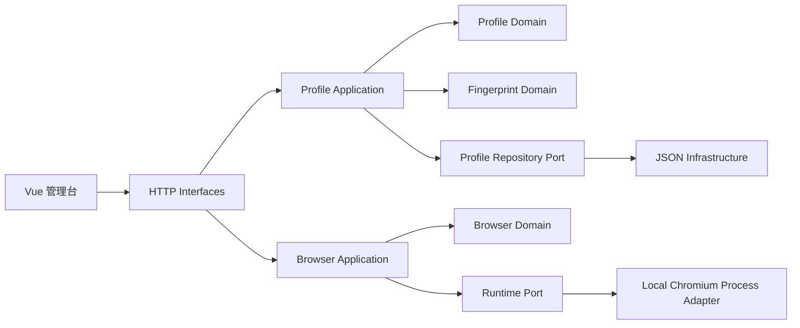

# ProfileWeave Browser 实现方案（RFC-001）

> 状态：Accepted for MVP
> 本文先于代码实现创建，是后续实现与验收的依据。

## 1. 产品定位

ProfileWeave Browser 是一个本地优先的浏览器身份配置与隔离运行器，服务三类场景：

- QA：用稳定的语言、时区、窗口和代理组合复现区域/环境问题。
- 隐私研究：观察浏览器暴露面并减少 profile 之间的存储关联。
- 日常隔离：为客户、项目或临时任务保留独立 cookies、cache 和 localStorage。

MVP 不承诺绕过风控，不实现验证码、账号批量操作、站点专用规避规则，也不把 JS 注入包装成内核级反检测。

## 2. 交付范围

### P0（本次实现）

- Vue 3 管理台：profile 列表、搜索、新建、编辑、复制、删除。
- 指纹配置束：OS 目标、原生/自定义 UA、语言、时区、屏幕、DPR、CPU、内存、WebRTC 策略。
- 代理配置：direct、HTTP、SOCKS5（无认证）。
- 一致性诊断：错误、警告、信息三级结果和 0-100 健康分。
- 浏览器发现：Chrome、Edge、Brave、Chromium、自定义路径。
- 独立 user-data-dir；启动、停止、运行状态和进程号。
- 本地 JSON 持久化，原子写入。
- loopback HTTP API、同源保护、结构化错误。
- Go 单元/集成测试、Vue 单元测试、构建和行数守卫。

### P1（保留扩展点）

- chromedp 适配器：对受控 target 应用时区、locale、geolocation。
- 内核适配器：Camoufox/自维护 Chromium fork，经许可证审查后接入。
- OS 密钥链保存代理凭据。
- profile 导入导出、分组和审计事件。
- 本地指纹自检页和可重复的隐私回归测试。

## 3. DDD 限界上下文



### Profile Context

- 聚合根 `Profile`：ID、名称、备注、标签、启动页、浏览器选择、Fingerprint、Proxy、时间戳。
- 不变量：名称非空；ID 安全；启动页只能是 HTTP(S)；代理端点合法；更新后 revision 增长。
- 仓储端口 `Repository`：List/Get/Save/Delete。
- 应用服务：Create、Update、Duplicate、Delete、List、Get。

### Fingerprint Context

- 值对象 `Fingerprint`、`Screen`、`Proxy`。
- 领域服务 `Evaluator`：计算一致性问题和健康分。
- 规则关注：UA/OS、locale/languages、timezone、screen/DPR、hardware 值、proxy/WebRTC、运行时支持度。
- 结果是业务对象 `Report`，而不是 HTTP DTO。

### Browser Context

- 实体 `Session`：ProfileID、状态、PID、StartedAt、StoppedAt、LastError。
- 端口 `Runtime`：Discover、Launch、Stop。
- 应用服务保证同一 profile 单实例，并将进程事件转换为 session 状态。
- 基础设施 `ProcessRuntime` 负责浏览器定位、参数构造、独立目录和 `exec.Cmd` 生命周期。

## 4. 目录结构

```text
.
├── AGENTS.md
├── README.md
├── cmd/server/
├── docs/
├── frontend/
│   ├── src/
│   │   ├── api/
│   │   ├── components/
│   │   ├── composables/
│   │   ├── domain/
│   │   └── styles/
│   └── ...
├── internal/
│   ├── profile/{domain,application,infrastructure}/
│   ├── fingerprint/domain/
│   ├── browser/{domain,application,infrastructure}/
│   └── platform/httpapi/
└── scripts/
```

依赖方向只能从外向内：interfaces/infrastructure → application → domain。

## 5. API 契约

| 方法 | 路径 | 用途 |
| --- | --- | --- |
| GET | `/api/v1/health` | 健康状态与版本 |
| GET | `/api/v1/capabilities` | 浏览器发现和 runtime 能力 |
| GET/POST | `/api/v1/profiles` | 列表/创建 |
| GET/PUT/DELETE | `/api/v1/profiles/{id}` | 详情/更新/删除 |
| POST | `/api/v1/profiles/{id}/duplicate` | 复制 profile，不复制运行状态 |
| POST | `/api/v1/profiles/{id}/validate` | 返回一致性报告 |
| GET | `/api/v1/sessions` | 当前与最近 session |
| POST | `/api/v1/profiles/{id}/launch` | 校验后启动 |
| POST | `/api/v1/profiles/{id}/stop` | 停止实例 |

统一错误格式：

```json
{
  "error": {
    "code": "profile_invalid",
    "message": "配置存在阻止启动的问题",
    "details": [{ "field": "fingerprint.timezone", "message": "未知时区" }]
  }
}
```

## 6. 浏览器启动映射

| 配置 | MVP 应用方式 | 保证等级 |
| --- | --- | --- |
| user-data-dir | `--user-data-dir=<独立目录>` | 强：存储隔离 |
| locale/languages | `--lang` 与本地 Preferences | 中：浏览器支持决定最终表现 |
| proxy | `--proxy-server` | 中：浏览器 HTTP 流量；不是系统 VPN |
| WebRTC proxy_only | Chromium WebRTC IP handling flags | 中：减少非代理 UDP，不保证所有版本一致 |
| window size/DPR | `--window-size` / `--force-device-scale-factor` | 中：窗口管理器可能调整 |
| custom UA | `--user-agent` | 弱：仅在显式选择时使用，无法同步所有 Client Hints/TLS |
| timezone | MVP 仅校验与展示 | 未应用：UI 明确标记；P1 由 CDP/内核适配器实现 |
| CPU/device memory | MVP 仅作为期望值和诊断项 | 未应用：不做易检测 JS 注入 |
| canvas/WebGL/audio | 使用浏览器原生策略 | 原生：不伪造 |

因此能力 API 必须返回 `applied`、`partial`、`unsupported`，前端不能把“已保存”展示为“已在浏览器内核生效”。

## 7. 安全设计

- 默认地址 `127.0.0.1:3210`；显式配置才能改变端口，MVP 不允许改变 host。
- 所有 API 方法校验 loopback `Host`；非安全方法同时校验 `Origin`/Fetch Metadata 和每进程随机控制令牌，拒绝跨站驱动本地进程。
- JSON body 限制大小，未知字段拒绝，错误不回显敏感路径以外的进程环境。
- Profile ID 由服务端生成，只允许安全字符；任何磁盘路径都通过固定根目录拼接并校验。
- 浏览器启动使用 `exec.Command(executable, args...)`，不经过 PowerShell/cmd/bash。
- 自定义浏览器必须是存在的普通文件；不允许附带参数。
- 不持久化代理密码，不开放远程调试端口。
- 删除运行中的 profile 返回冲突；停止操作只作用于该服务创建并持有的进程。

## 8. 数据存储

- `data/profiles.json`：带 `schemaVersion` 的 profile 列表。
- `data/browser-data/{profileID}/`：浏览器持久数据。
- 仓储写入临时文件、`Sync`、原子 rename；进程内 mutex 防止并发覆盖。
- Session 是易失状态；应用重启后不尝试接管未知进程。

## 9. 前端体验

- 首屏直接回答：有多少 profile、多少正在运行、当前 runtime 能力是否完整。
- 卡片展示名称、标签、浏览器、地区组合、代理、健康分与运行状态。
- 编辑器分“基本信息 / 网络 / 指纹与一致性”三段，复杂设置提供解释。
- 保存前实时诊断；错误阻止保存/启动，警告允许保存但启动前再次确认（MVP 以明确提示代替弹窗确认）。
- 移动端仍可查看和停止；复杂编辑以桌面宽度为主。
- 颜色不是状态的唯一载体；按钮和表单有可访问名称与焦点样式。

## 10. 测试策略

- Domain：所有不变量和一致性规则表驱动测试。
- Application：内存 fake repository/runtime，覆盖单实例、复制、删除冲突。
- Infrastructure：临时目录验证原子持久化；纯函数验证浏览器参数，避免测试真的启动浏览器。
- HTTP：`httptest` 覆盖路由、状态码、body 限制、Origin guard。
- Frontend：Vitest 覆盖 store/composable 与关键组件交互；Vite production build 验证类型和打包。
- Manual smoke：创建 profile → 查看报告 → 启动已发现浏览器 → 产生独立目录 → 停止 → 重启服务仍能看到 profile。

## 11. 取舍记录

- **不用 Wails**：MVP 用 Go HTTP + Vue，可独立测试、未来可由 Wails/Electron/系统壳封装，减少首版桌面框架耦合。
- **Go 标准库优先**：HTTP、JSON 仓储、进程管理不需要第三方依赖，降低空仓初始化和供应链成本。
- **不用 SQLite**：当前单用户、低并发、小数据集，原子 JSON 足够；若引入审计和团队同步再迁移。
- **不用 JS 指纹伪造**：保证诚实与一致性，避免制造比原生更独特的配置。
