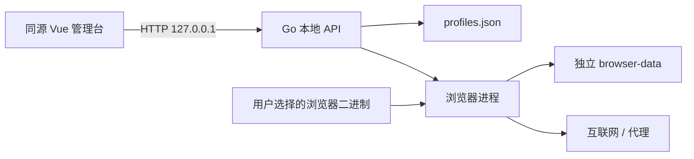

# ProfileWeave 威胁模型

> 版本：0.1，更新日期：2026-07-17。本文描述本地单用户版本的安全边界，不代表对恶意操作系统、已入侵浏览器或不受信任第三方运行时提供防护。

## 1. 保护目标

- Profile 元数据、cookies、localStorage、cache 和站点权限不被其他 Profile 意外复用。
- 只有本机用户主动打开的管理台能够创建、修改、启动和停止 Profile。
- 浏览器启动参数不经过 shell，Profile 输入不能转化为命令注入或目录穿越。
- 发行包能追溯版本、commit 与构建时间，并携带许可证、校验和、SBOM 和构建来源证明。
- 产品能力声明与实际 runtime 能力一致，不把诊断字段表述为已应用。

## 2. 信任边界

管理台与 Go 服务处于同一应用信任域；浏览器页面、互联网、代理服务器、自定义浏览器二进制和任何第三方 runtime 均不受信任。操作系统账户与本机文件权限属于外部可信基础，ProfileWeave 不是磁盘加密或多用户权限系统。

## 3. 主要威胁与控制

| 威胁 | 当前控制 | 剩余风险 |
| --- | --- | --- |
| 恶意网页访问本地 API | 固定 loopback 监听；API 校验 loopback Host、Origin/Fetch Metadata；写请求要求每进程随机令牌；API 禁缓存 | 同一 OS 用户下的本地恶意进程可直接读取 loopback 端口，不在浏览器同源防护范围内 |
| DNS rebinding / Host 欺骗 | 所有 API 方法校验 `Host` 为 loopback，不只保护写方法 | 被授予本机网络权限的恶意软件不在浏览器同源模型内 |
| Clickjacking | `frame-ancestors 'none'`、`X-Frame-Options: DENY` | 浏览器扩展可能拥有更高权限 |
| XSS 与资源注入 | CSP、同源脚本、`nosniff`、无动态 HTML 注入 | CSP 为兼容现有 Vue 样式允许 inline style，后续可改 nonce/hash |
| Profile ID 目录穿越 | ID 由服务生成且格式固定；磁盘路径限定在数据根目录 | 用户自选数据根仍需由用户确保访问权限 |
| 浏览器参数/命令注入 | `exec.Command(executable, args...)`，不经过 shell；自定义路径必须为普通文件 | 被替换的受信二进制可以执行任意代码 |
| 数据删除后残留 | 删除时先停止/拒绝运行中 Profile，并把 browser-data 原子移动到应用回收区；仓储失败时回滚 | 回收区仍包含敏感数据，需要后续提供显式清空与保留策略 |
| Profile 并发运行 | 应用服务单实例检查，数据目录按 ID 独占 | 服务崩溃后的未知子进程暂不自动接管 |
| 代理泄漏 | 仅支持无认证代理，不落密码；能力报告明确代理不是 VPN | DNS、扩展、浏览器自身服务和 WebRTC 行为受版本影响 |
| 第三方运行时供应链 | 默认只发现系统浏览器；不自动下载；要求显示来源/许可/版本 | 系统浏览器或自定义 binary 的真实性由用户/OS 负责 |
| Release 被篡改 | Release 输出 SHA256、SBOM、provenance；版本元数据注入 | Windows Authenticode 与 macOS notarization 尚未完成 |

## 4. 明确不覆盖

- 已获得当前 OS 用户权限的恶意程序、键盘记录、内存读取或磁盘窃取。
- 网站通过网络、TLS、行为、账号关系或浏览器漏洞识别用户。
- 第三方代理、扩展、自定义浏览器或内核的隐私与安全保证。
- 多用户、团队权限、远程 API 暴露和云同步。
- CAPTCHA 绕过、站点风控规避或“不可检测”承诺。

## 5. 发布前安全门槛

1. `go test ./...`、`go vet ./...`、前端测试和 production build 通过。
2. `govulncheck ./...` 与 `pnpm audit --prod` 无已知漏洞，或在 Release notes 中记录有时限的风险接受。
3. 所有 API/静态安全头测试、路径边界测试和数据回滚测试通过。
4. Release 附带项目许可证、第三方 notices、SHA256、SBOM 与 provenance。
5. 在真实 Git 仓库核对受保护分支、私密漏洞报告、secret scanning 和 tag 保护。

安全问题的报告方式与支持版本见根目录 [SECURITY.md](../SECURITY.md)。
